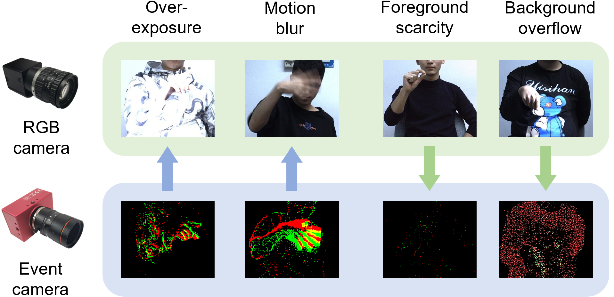

# EvRGBHand [CVPR'24] ✨✨

[[Project Page](https://alanjiang98.github.io/evrgbhand.github.io/)]  [[Data](https://www.dropbox.com/scl/fi/x3bmfw2tfmqaghagb6alx/EvRealHands.zip)] [[Paper](https://arxiv.org/abs/2403.07346)]

- This is the official PyTorch implementation of [Complementing Event Streams and RGB Frames for Hand Mesh Reconstruction](https://github.com/AlanJiang98/EvRGBHand).
- This work investigates the feasibility of using events and images for HMR, and proposes the first solution to 3D HMR by complementing event streams and RGB frames.
<div  align="center">    
 
</div>

## Usage 

### Installation
```bash
# Create a new environment
conda create --name evrgb python=3.9
conda activate evrgb

# Install Pytorch
conda install pytorch=2.1.0  torchvision=0.16.0  pytorch-cuda=11.8 -c pytorch -c nvidia

# Install Pytorch3D
conda install -c fvcore -c iopath -c conda-forge fvcore iopath
conda install pytorch3d -c pytorch3d

# Install requirements
pip install -r requirements.txt
```
Our codebase is developed based on Ubuntu 23.04 and NVIDIA GPU cards. 


### Train
- Download the EvRealHands dataset from [EvHandPose](https://alanjiang98.github.io/evhandpose.github.io/) and change the path in the ``src/datasets/dataset.yaml`` .
- Download MANO models from [MANO](https://mano.is.tue.mpg.de/download.php). Put the ```MANO_LEFT.pkl``` and ```MANO_RIGHT.pkl``` to ```models/mano```.
- Modify the config file in ``src/configs/config`` .

```shell
python train.py  --config <config-path> 
```

### Evaluation

- Download the pretrained model for the [EvImHandNet](https://drive.google.com/file/d/19dB8KSkdk502l4hZQUY3Eo24Vcw1tHBH/view?usp=drive_link)
```shell
python train.py --config <config-path>  --resume_checkpoint <pretrained-model> --config_merge <eval-config-path>  --run_eval_only --output_dir <output-dir>

#For example 
python train.py --config src/configs/config/evrgbhand.yaml --resume_checkpoint output/EvImHandNet.pth --config_merge src/configs/config/eval_temporal.yaml --run_eval_only --output_dir result/evrgbhand/
```

## Citation

```bibtex
@inproceedings{Jiang2024EvRGBHand,
      title={Complementing Event Streams and RGB Frames for Hand Mesh Reconstruction}, 
      author={Jiang, Jianping and Zhou, Xinyu and Wang, Bingxuan and Deng, Xiaoming and Xu, Chao and Shi, Boxin},
      booktitle={CVPR},
      year={2024}
}
```
